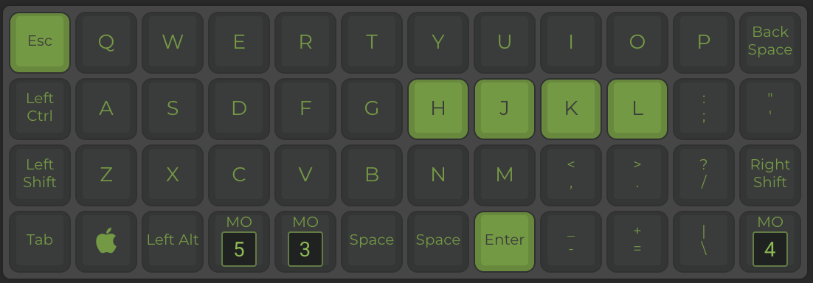
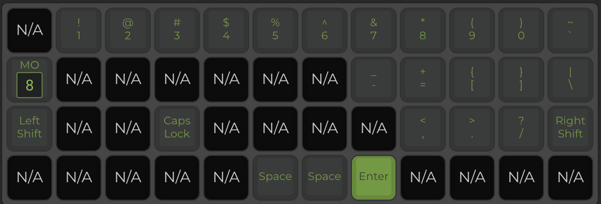
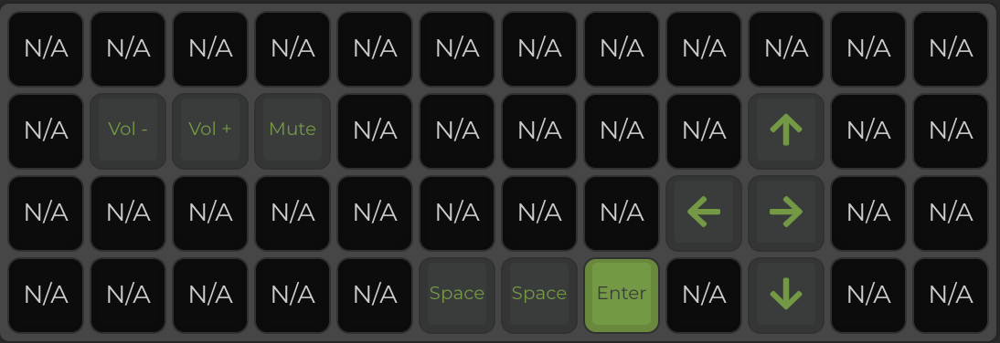
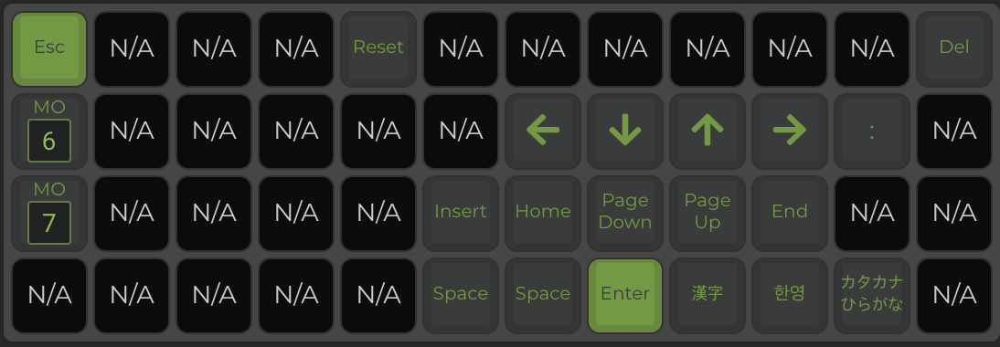
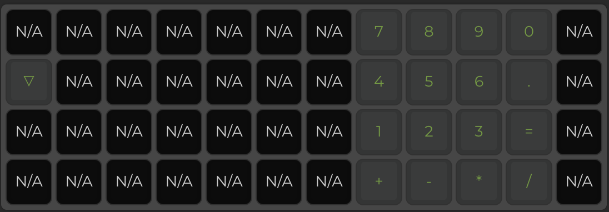
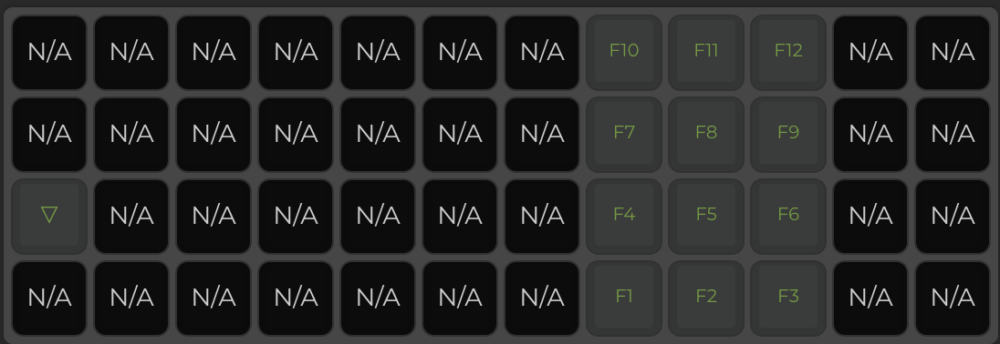
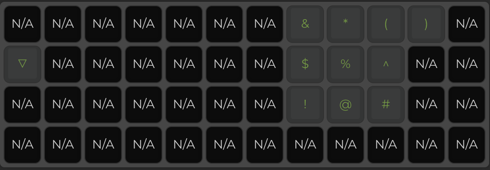

# Planck 
---
## Tescom's Key Layout

---
- Last Update : 2020.05.24
- FileName    : planck_rev6_00005.bin
---

## Installation guide
- qmk tool box 다운로드 [Link](https://github.com/qmk/qmk_toolbox/releases/tag/0.0.18)
- qmk tool box 설치
- qmk firmware 설치 
```shell
### firmware설치에 필요한 패키지 설치
$ brew tap osx-cross/avr
$ brew tap PX4/homebrew-px4
$ brew update
$ brew install avr-gcc@8
$ brew install dfu-programmer
$ brew install dfu-util
$ brew install gcc-arm-none-eabi
$ brew install avrdude

### qmk firmware 다운로드
$ git clone https://github.com/t2sc0m/qmk_firmware.git 

### qmk firmwal 설치
$ cd qmk_firmware
$ ./util/qmk_install.sh
``` 
- 키보드 연결 후 디폴트 레이아웃 적용
```shell
$ sudo make planck/rev6:default:flash
```
- 키보드 입력 테스트
---

## 키보드 레이아웃 변경
- 변경 사이트 [링크](https://config.qmk.fm/#/planck/rev6/LAYOUT_ortho_4x12)
- 레이아웃 변경 후 KEYMAP.JSON, FIRMWARE를 다운로드
- 키보드 뒷면의 reset 또는 지정한 reset를 누름
- qmk tool box에서 다운받은 bin파일을 오픈
- Flash 버튼을 클릭하면 키보드의 firmware업데이트가 실행되고 자동으로 키보드가 재시작
- 키보드 입력 테스트
---

# 00005버전 레이어 

## Layer 0
- 일반 배열 
- Layer 3, 4, 5

---

## Layer 1, 2
- 사용안함
---

## Layer 3
- 특수문자/숫자
- Layer 8

---

## Layer 4
- HHKB Fn 배열

---

## Layer 5
- VIM 배열/특수키
- Layer 6, 7

---

## Layer 6
- TenKey 배열
- 사칙연산, 등호

---

## Layer 7
- 펑션키 F[1-12]

---

## Layer 8
- TenKey 배열 특수문자

---
